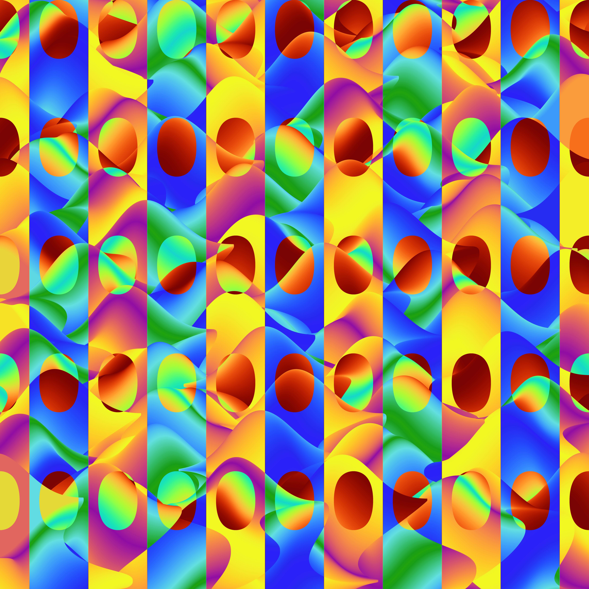

# ScriptedStyles  

**Algorithmic Art + Automation in Python**  

ScriptedStyles is a Python-based framework for generating and automating digital artwork using mathematical algorithms, image processing, and data-driven visualization methods.  

Originally begun as a personal project, it has evolved into a platform for experimenting with:  
- **Algorithmic generation** of patterns, structures, and visual forms.  
- **Scientific visualization** techniques applied creatively.  
- **Automation pipelines** for bulk processing and uploading images (e.g., Instagram, Etsy, Pinterest).  
- **Exploration of applied math and physics concepts** through code.  

---

## Features
- Mathematical and algorithmic artwork generation (fractals, diffusion, tilings, geometric patterns).  
- Reproducible workflows built in Python using **NumPy**, **Matplotlib**, and **SciPy**.  
- Modular codebase for testing new generative ideas.  
- Automation stack for batch-uploading to social and e-commerce platforms.  
- Example image sets included in `Sample_Images`.  

---

## Usage

**Requirements:**  
- Python 3.x  
- NumPy, Matplotlib, SciPy  

**Quick start:**  
```bash

git clone https://github.com/hschn58/ScriptedStyles.git

python3 ScriptedStyles/Codebase/Designs/Releases/Next_release/Heatmap/flowers_v4.py     
```

Further customization detailed in flowers_v4.py script header overview.

---
**Generated Samples**


Here are a few representative outputs generated with the scripts in this repo:

<p align="center">
  
  
  
</p>

*(Click thumbnails to view full size. See the `Sample_Images/` folder for more.)*

**Real-World Deployment**

This not only functioned as a personal project but used to be an active e-commerce automation pipeline:

- **Artwork generation** → produced in Python using the scripts in this repo.  
- **Fulfillment** → connected via Printify to create physical products.  
- **Storefront** → integrated with Etsy to manage product listings.  
- **Marketing** → automated posting of generated images to Instagram and Facebook to drive engagement.  

**Links to deployed channels:**  
- Instagram: [@scriptedstylesart](https://www.instagram.com/scriptedstylesart)  
- Facebook: [ScriptedStyles](https://www.facebook.com/profile.php?id=61572520106684)  
- Etsy: [ScriptedStylesArt Shop](https://www.etsy.com/shop/ScriptedStylesArt)  

---

## License

This project is licensed under the [MIT License](./LICENSE).

